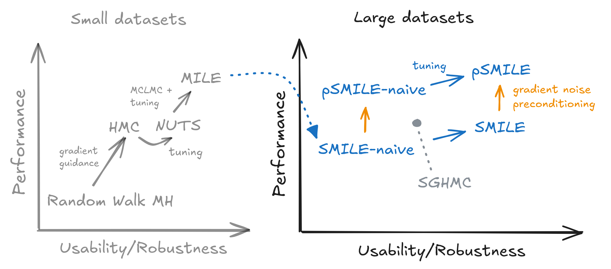

# Stochastic Microcanonical Langevin Ensembles (SMILE) 😃

Code for the ICLR 2026 submission: **Can Microcanonical Langevin Dynamics be Made Stochastic?**

Below you can find a qualitative contextualization of the newly proposed and explored methods (in blue) relative to prior work (in grey).

<p align="center">
    
</p>


## Setup

We use python `3.12` (newer stable versions should work as well) and [Poetry](https://python-poetry.org/) (make sure you have it installed) to manage dependencies. To install the dependencies within a virtual environment, run the following commands:


```bash
python -m venv venv
source venv/bin/activate
poetry install --all-extras
```

## File Structure

```
.
├── data/                    Data folder
├── scripts/
│   ├── experiment_configs/  Folder with folders of detailed experiment configuration files
│   └── experiment_utils/    Folder with a CLI tool making it easy to aggregate results across multiple experiments
├── src/                     Source code of the project
├── README.md                This file
├── pyproject.toml           Poetry configuration file
└── poetry.lock              Poetry generated file for managing dependencies
```

> **Note:** This codebase is partly an adaptation/extension of the following codebases: [MILE](https://github.com/EmanuelSommer/MILE), [SAI](https://github.com/EmanuelSommer/sampled-approx-posteriors), and the [dataserious](https://github.com/Noza23/dataserious).

## Usage

The individual experiments can be easily exectuted using the `src` module. To see all available options, run:

```bash
python -m src -h
```

To run a single experiment on 10 available cores, use the following command:

```bash
python -m src -c scripts/experiment_configs/uci_benchmarks/tabular_regr_psmile_naive.yaml -d 10
```

To run hyperparameter sweeps or replicate experiments across multiple seeds and data splits, use the following command:

```bash
python -m src \
    -c scripts/experiment_configs/uci_benchmarks/tabular_regr_psmile_naive.yaml \
    -d 10 \
    -s scripts/experiment_configs/uci_benchmarks/uci_search_config.yaml
```

## Results Storage

After executing experiments, all results will be automatically stored in a dedicated subfolder within the (automatically generated) `results/` directory. Each experiment's output includes:

- A copy of the `config.yaml` used for configuration
- Trained deep ensemble models in the `warmstart/` subdirectory
- Model posterior samples saved in the `samples/` subdirectory
- Evaluation metrics and outputs in the `eval/` subdirectory
- Detailed training logs

